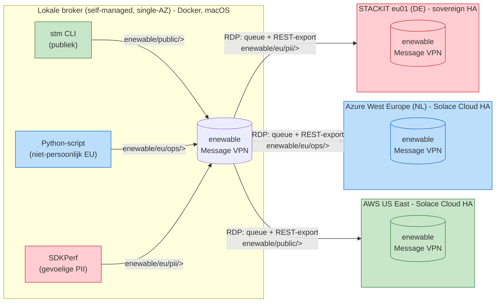

# Topologie

## Overzicht

Vier Solace-brokers, drie dataklassen, drie REST Delivery Points (RDP) --
elke dataklasse mag naar precies één bestemming. (Eerder onderzocht en
verlaten: Message VPN Bridges, die alleen kunnen *importeren* van een
remote broker, niet exporteren -- zie "Waarom RDP's" hieronder.)

(Bron: `topology/topologie.mmd` -- zelfde diagram, los renderbaar met elke
Mermaid-viewer of `mmdc`.)

## Brokers

| # | Broker              | Type                                   | Locatie                | Rol                                  |
|---|----------------------|-----------------------------------------|--------------------------|----------------------------------------|
| 1 | Lokaal                | Self-managed software, single-AZ, Docker | Laptop (macOS)           | Bron van alle demo-data, exporteert via 3 REST Delivery Points |
| 2 | AWS US East           | Solace Cloud, HA                         | AWS, US East              | Ontvangt **publieke** data              |
| 3 | Azure West Europe    | Solace Cloud, HA                         | Azure, West Europe (NL)   | Ontvangt **niet-persoonlijke EU**-data  |
| 4 | STACKIT eu01          | Sovereign HA (zie open punt hieronder)   | STACKIT, Duitsland        | Ontvangt **gevoelige PII**              |

## Topic-taxonomie

| Topic-subtree            | Dataklasse            | Voorbeeld                                   | RDP naar |
|----------------------------|------------------------|-----------------------------------------------|-------------|
| `enewable/public/>`        | Publiek                | Day-ahead energieprijs, publieke weerdata     | AWS (`rdp-aws`)     |
| `enewable/eu/ops/>`        | Niet-persoonlijk, EU    | Geaggregeerde netbelasting per postcodegebied | Azure (`rdp-azure`) |
| `enewable/eu/pii/>`        | Gevoelige PII           | Individuele slimme-meterstand + klant-ID      | STACKIT (`rdp-stackit`) |

Elke queue/RDP-paar moet uitsluitend zijn eigen subtree exporteren, en elke
publicerende client-username mag (via een ACL-profiel) uitsluitend op zijn
eigen subtree publiceren -- de dubbele "governed export": eenmaal aan de bron
(publish-ACL) en eenmaal aan de grens (queue-subscriptie/RDP).

**✅ Opgelost via REST Delivery Points (zie `PLAN.md` sectie 13, punt 11, en
`../docs/lokale-broker.md`, "Definitieve keuze"):** een Message VPN Bridge's
`remoteSubscription` trekt berichten van de remote broker naar binnen
(import), niet naar buiten -- dat bleek de kern van waarom bridges niet
werkten voor export zonder een publiek bereikbare lokale broker. In plaats
daarvan gebruikt deze demo nu een **queue per topic-subtree** (vangt de
lokaal DIRECT gepubliceerde berichten automatisch op via Solace's "message
promotion") + een **REST Delivery Point** die elke queue naar het REST-
endpoint van de bijbehorende cloud-broker post, op exact dezelfde topic
(`postRequestTarget: "/${topic()}"`). Geen publieke bereikbaarheid van de
lokale broker nodig -- de RDP dialt net als een bridge zelf uit.

## Interim: STACKIT-knooppunt tijdelijk gemimickt op GCP België

Tot STACKIT algemeen beschikbaar is in Solace Cloud (verwacht komende week),
staat er op de plek van "STACKIT eu01" in dit diagram feitelijk een Solace
Cloud HA-service op **GCP, europe-west1 (België)**. Topics, ACL-profiel en
bridge-naam (`bridge-to-stackit`) blijven ongewijzigd -- alleen het fysieke
eindpunt wisselt zodra STACKIT GA is. Zie
`../cloud-setup/gcp-europe-west1-interim/README.md` en
`../cloud-setup/stackit-eu01/README.md`.

## Waarom REST Delivery Points en niet "echte" `#noexport`/DMR?

De presentatie noemt `#noexport` als Solace-mechanisme om data fysiek te
laten blokkeren over Dynamic Message Routing (DMR)-links tussen
geclusterde brokers. Deze demo gebruikt in plaats daarvan **queues +
REST Delivery Points** met topic-scoped subscriptions: functioneel
identiek voor deze demo (data die niet in een subtree zit, kan een RDP niet
verlaten, want de bijbehorende queue heeft er geen subscription op), maar
architecturaal een ander mechanisme dan DMR/`#noexport`. (Message VPN
Bridges waren het eerst geprobeerde alternatief, maar konden -- zonder een
publiek bereikbare lokale broker -- alleen importeren, niet exporteren; zie
`PLAN.md` sectie 13 voor de volledige onderbouwing.) Zie `PLAN.md`, sectie
"Wat ontbreekt of kan beter" voor de afweging en hoe je dit dichter bij de
`#noexport`-demonstratie uit de slides zou brengen.
