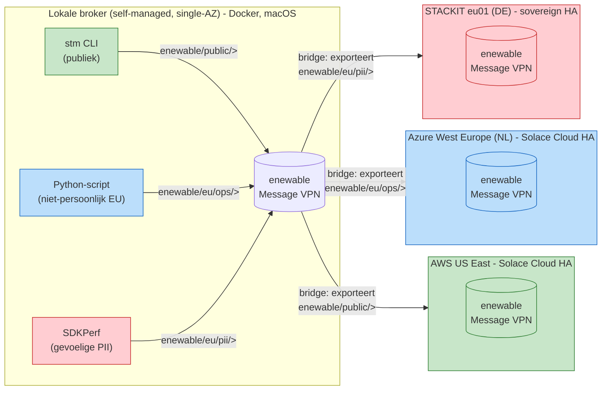

# Topologie

## Overzicht

Vier Solace-brokers, drie dataklassen, drie bridges -- elke dataklasse mag
naar precies één bestemming:

(Bron: `topology/topologie.mmd` -- zelfde diagram, los renderbaar met elke
Mermaid-viewer of `mmdc`.)

## Brokers

| # | Broker              | Type                                   | Locatie                | Rol                                  |
|---|----------------------|-----------------------------------------|--------------------------|----------------------------------------|
| 1 | Lokaal                | Self-managed software, single-AZ, Docker | Laptop (macOS)           | Bron van alle demo-data, exporteert via 3 bridges |
| 2 | AWS US East           | Solace Cloud, HA                         | AWS, US East              | Ontvangt **publieke** data              |
| 3 | Azure West Europe    | Solace Cloud, HA                         | Azure, West Europe (NL)   | Ontvangt **niet-persoonlijke EU**-data  |
| 4 | STACKIT eu01          | Sovereign HA (zie open punt hieronder)   | STACKIT, Duitsland        | Ontvangt **gevoelige PII**              |

## Topic-taxonomie

| Topic-subtree            | Dataklasse            | Voorbeeld                                   | Bridge naar |
|----------------------------|------------------------|-----------------------------------------------|-------------|
| `enewable/public/>`        | Publiek                | Day-ahead energieprijs, publieke weerdata     | AWS         |
| `enewable/eu/ops/>`        | Niet-persoonlijk, EU    | Geaggregeerde netbelasting per postcodegebied | Azure       |
| `enewable/eu/pii/>`        | Gevoelige PII           | Individuele slimme-meterstand + klant-ID      | STACKIT     |

Elke bridge exporteert (via een SEMP `remoteSubscription`) uitsluitend zijn
eigen subtree, en elke publicerende client-username mag (via een ACL-profiel)
uitsluitend op zijn eigen subtree publiceren. Dat is de dubbele "governed
export": eenmaal aan de bron (publish-ACL) en eenmaal aan de grens (bridge-
subscriptie) -- zie `../docs/lokale-broker.md`.

## Interim: STACKIT-knooppunt tijdelijk gemimickt op GCP België

Tot STACKIT algemeen beschikbaar is in Solace Cloud (verwacht komende week),
staat er op de plek van "STACKIT eu01" in dit diagram feitelijk een Solace
Cloud HA-service op **GCP, europe-west1 (België)**. Topics, ACL-profiel en
bridge-naam (`bridge-to-stackit`) blijven ongewijzigd -- alleen het fysieke
eindpunt wisselt zodra STACKIT GA is. Zie
`../cloud-setup/gcp-europe-west1-interim/README.md` en
`../cloud-setup/stackit-eu01/README.md`.

## Waarom bridges en niet "echte" `#noexport`/DMR?

De presentatie noemt `#noexport` als Solace-mechanisme om data fysiek te
laten blokkeren over Dynamic Message Routing (DMR)-links tussen
geclusterde brokers. Deze demo gebruikt in plaats daarvan gewone
**Message VPN Bridges** met topic-scoped `remoteSubscriptions`: functioneel
identiek voor deze demo (data die niet in een subtree zit, kan een bridge
niet verlaten), maar architecturaal een ander mechanisme dan DMR/`#noexport`.
Zie `PLAN.md`, sectie "Wat ontbreekt of kan beter" voor de afweging en hoe je
dit dichter bij de `#noexport`-demonstratie uit de slides zou brengen.
